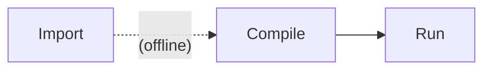

# ONNX Operator Tests

This test suite exercises ONNX (Open Neural Network Exchange: https://onnx.ai/)
operators (https://onnx.ai/onnx/operators/).

Testing follows several stages:



Importing is run "offline" and the outputs are checked in to the repository for
ease of use in downstream projects and by developers who prefer to work directly
with `.mlir` files and native (C/C++) tools.

Test cases are imported from upstream ONNX tests:

Directory in [onnx/onnx](https://github.com/onnx/onnx/) | Description
-- | --
[`onnx/backend/test/case/`](https://github.com/onnx/onnx/tree/main/onnx/backend/test/case) | Python source files
[`onnx/backend/test/data/`](https://github.com/onnx/onnx/tree/main/onnx/backend/test/data) | Generated `.onnx` and `[input,output]_[0-9]+.pb` files

The [`import_onnx_tests.py`](./onnx/import_onnx_tests.py) script walks the
`data/` folder and generates test cases into our local
[`generated/` folder](./generated/).

To regenerate the test cases:

```bash
# Virtual environment setup.
python -m venv .venv
source .venv/bin/activate
python -m pip install -r requirements-dev.txt

# Import all test cases (may take a few minutes).
python import_onnx_tests.py
```

## Test case structure

Each test case is a folder containing a few files:

```text
[test case name]/
  model.mlir
  input_0.bin
  input_1.bin
  ...
  output_0.bin
  output_1.bin
  ...
  run_module_io_flags.txt
```

Where:

* `model.mlir` is in a format that is ready for use with `iree-compile`
* `input_0.bin` and `output_0.bin` files correspond to any number of program
  inputs and outputs for one test case
* `run_module_io_flags.txt` is a flagfile for use with
  `iree-run-module --flagfile=run_module_io_flags.txt` of the format:

  ```text
  --input=2x3xf32=@input_0.bin
  --expected_output=2x3xf32=@output_0.bin
  ```
