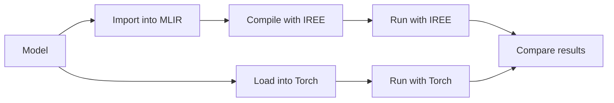

# PyTorch Model Tests

This test suite exercises [PyTorch](https://pytorch.org/) models. Pretrained
models could be sourced from these or other sources:

* https://pytorch.org/vision/stable/models.html
* https://pytorch.org/audio/stable/models.html
* https://pytorch.org/hub/
* https://huggingface.co/models?library=pytorch
* https://github.com/huggingface/transformers

Testing *currently* follows several stages:


Testing *could* also test inference and compare with PyTorch:



## Quickstart

1. Set up your virtual environment and install requirements:

    ```bash
    python -m venv .venv
    source .venv/bin/activate
    python -m pip install -r requirements.txt
    ```

    * To use `iree-compile` and `iree-run-module` from Python packages:

        ```bash
        python -m pip install -r requirements-iree.txt
        ```

    * To use a custom version of IREE or iree-turbine, follow the instructions
      for
      [building the IREE Python packages from source](https://iree.dev/building-from-source/getting-started/#python-bindings)
      and the developer instructions for
      https://github.com/iree-org/iree-turbine.

2. Run pytest using typical flags:

    ```bash
    pytest \
      -rA \
      --log-cli-level=info \
      --durations=0
    ```

    See https://docs.pytest.org/en/stable/how-to/usage.html for other options.

## Advanced pytest usage

* The `log-cli-level` level can also be set to `debug`, `warning`, or `error`.
  See https://docs.pytest.org/en/stable/how-to/logging.html.
* Run only tests matching a name pattern:

    ```bash
    pytest -k resnet
    ```

* Ignore xfail marks
  (https://docs.pytest.org/en/stable/how-to/skipping.html#ignoring-xfail):

    ```bash
    pytest --runxfail
    ```

* Run tests in parallel using https://pytest-xdist.readthedocs.io/
  (note that this swallows some logging):

    ```bash
    # Run with an automatic number of threads (usually one per CPU core).
    pytest -n auto

    # Run on an explicit number of threads.
    pytest -n 4
    ```

* Create an HTMl report using https://pytest-html.readthedocs.io/en/latest/index.html

    ```bash
    pytest --html=report.html --self-contained-html --log-cli-level=info
    ```

    See also
    https://docs.pytest.org/en/latest/how-to/output.html#creating-junitxml-format-files

## Test suite implementation details

TODO
